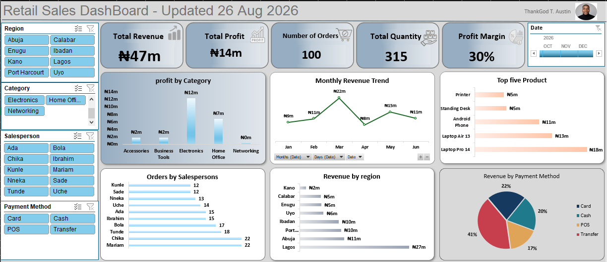

# Retail Sales Performance Dashboard

## Project Overview

This project involved developing an interactive retail sales performance dashboard entirely in Microsoft Excel.

The dashboard transforms sales data into a visual business intelligence report that helps monitor revenue, profitability, orders, product performance, regional performance, payment methods, and monthly sales trends.

## Business Objective

The objective was to create a clear and interactive reporting solution that enables stakeholders to:

- Monitor overall sales performance
- Track revenue and profitability
- Analyze product performance
- Compare regional sales performance
- Monitor order and quantity metrics
- Analyze revenue by payment method
- Identify monthly sales trends

## Key Performance Indicators

| KPI | Result |
|---|---:|
| Total Revenue | ₦47M |
| Total Profit | ₦14M |
| Total Orders | 100 |
| Quantity Sold | 315 |
| Profit Margin | 30% |

## Analysis Areas

- Revenue Analysis
- Profitability Analysis
- Regional Analysis
- Product Performance
- Salesperson Performance
- Payment Method Analysis
- Monthly Revenue Trends

## Tools & Skills

**Microsoft Excel**

- Data Cleaning
- Data Analysis
- PivotTables
- Data Visualization
- Dashboard Development
- KPI Reporting
- Business Intelligence

## Dashboard Preview

## Project Outcome

The dashboard provides a consolidated visual view of key retail sales and profitability metrics, making it easier to monitor business performance and communicate insights from the underlying data.

## Author

**ThankGod Timipere Austin**

Data Analyst | Excel & Power BI | SQL | Business Intelligence
